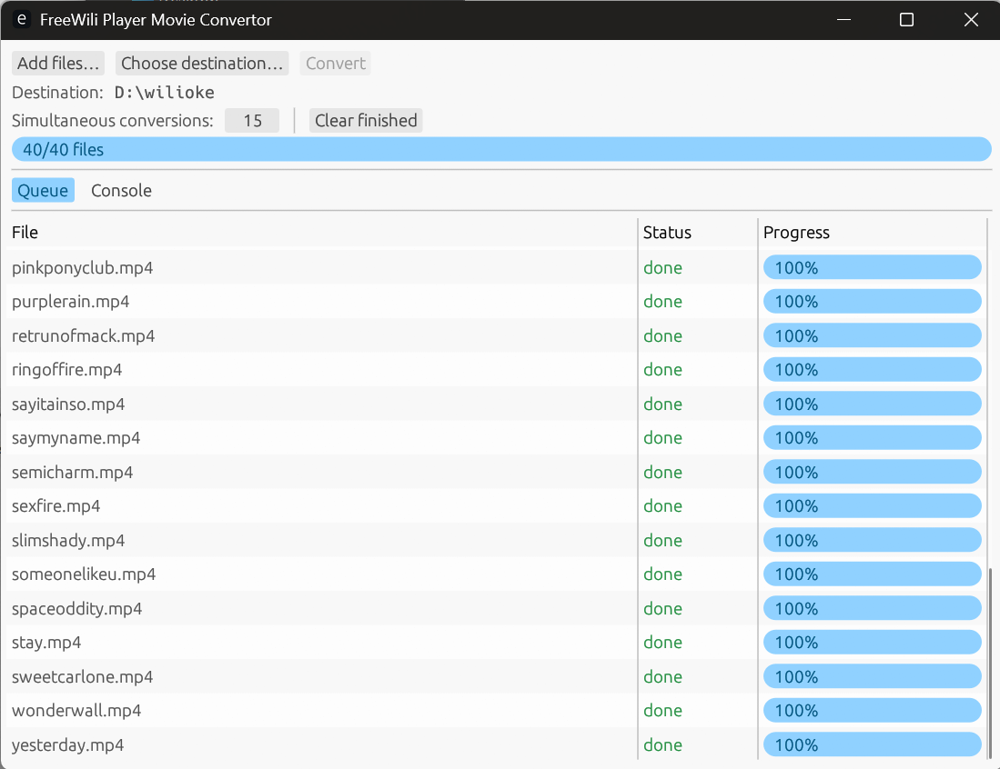

# FreeWili Player Movie Convertor

(`wiliplayerconvert`) A small desktop app that converts ordinary videos (MP4, MKV, MOV, …) into
`.fwmv` files for the **FreeWili movie player**. They run on FreeWili2 (https://www.freewili.com ) or Adafruit FruitJam (www.adafruit.com/product/6200). It builds as a single self-contained binary — FFmpeg is statically linked, so there is nothing else to
install. The code is cross-platform (Windows/Linux/macOS); so far it has been
built and validated on **Windows**, with Linux/macOS wired in CI (see
[`build/README.md`](build/README.md)).



## What it does

- Pick **multiple video files** at once (native file dialog).
- Pick a **destination folder** (native folder dialog).
- Convert them all, with a per-file status list and an overall progress bar.
- Each `input.mp4` becomes `input.fwmv` in the destination folder. If a name is
  already taken, it writes `input_1.fwmv`, `input_2.fwmv`, … (never overwrites).

Conversion uses the player's required settings: **480×270, 15 fps, MJPEG
(quality 10), mono 16 kHz audio**, full length (no size trimming). Sources are
scaled to fit 480×270 and letterboxed; audio is downmixed to mono.

## Using the output

Copy the `.fwmv` files to a USB thumb drive and plug it into the player:

- Format the drive as **FAT/FAT32**.
- Put the files in the **root** of the drive (subfolders are ignored).
- Up to **32 files**; they play in **alphabetical order** and loop
  (e.g. `01-intro.fwmv`, `02-main.fwmv`).

## Running

Once a release is published, download the binary for your OS and run it — no
installer, no dependencies. (Windows may need the Microsoft Visual C++ runtime,
which is present on virtually all machines.) Until then, build from source (below)
or grab the artifact from a CI run.

## Building from source

Building links FFmpeg statically and needs a one-time toolchain setup (Rust, a
static FFmpeg, and LLVM/libclang for bindgen). The full, reproducible recipe —
including the exact commands and why each piece is needed — is in
[`build/README.md`](build/README.md).

Quick version on the configured dev machine:

```bash
# FFmpeg code must build through the wrapper (sets up the MSVC/clang env):
powershell -ExecutionPolicy Bypass -File scripts/dev-cargo.ps1 build
powershell -ExecutionPolicy Bypass -File scripts/dev-cargo.ps1 test

# The pure-Rust format core has no FFmpeg dependency and tests with plain cargo:
cargo test --test adpcm --test fwmv_format --test fwmv_pack
```

## How it's built

- **`src/fwmv/`** — a dependency-free Rust implementation of the `.fwmv` v2
  container, IMA-ADPCM audio, and the seek index. It is a byte-for-byte port of
  the reference Python packer and is verified against golden vectors generated
  from it.
- **`src/convert.rs`** — drives statically-linked FFmpeg (demux → decode →
  scale/letterbox/fps filter → MJPEG encode; audio → mono 16 kHz s16) and hands
  the frames + PCM to the packer.
- **`src/app.rs`** — the egui/eframe GUI with native dialogs and a background
  worker thread.

## License

The application code is licensed under the **MIT License** (see [`LICENSE`](LICENSE)).

The binary statically links an **LGPL** build of FFmpeg (decoders + the built-in
MJPEG encoder; no GPL components) and the BSD-licensed **dav1d** AV1 decoder. See
`build/README.md` for the FFmpeg build configuration. Redistributing the binary is
subject to FFmpeg's LGPL terms.
